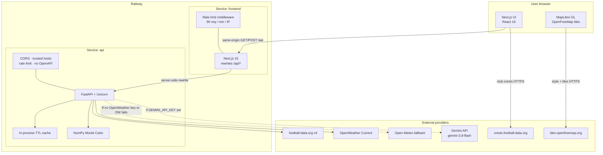
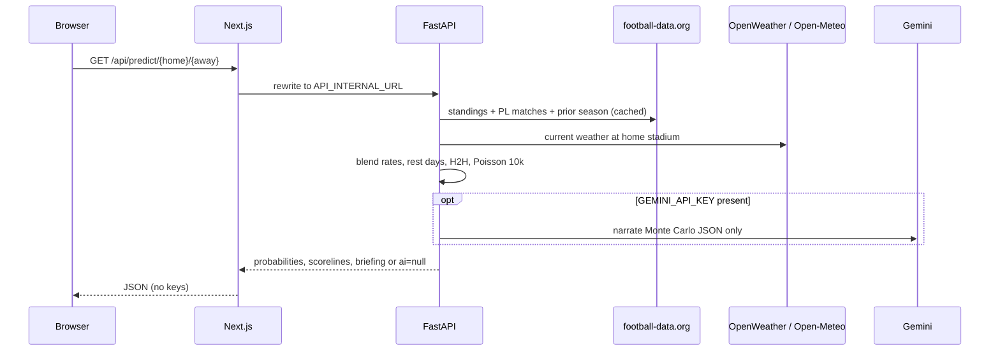
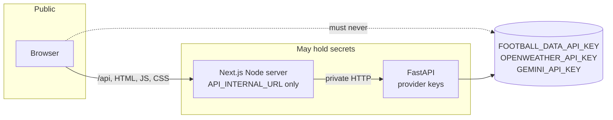
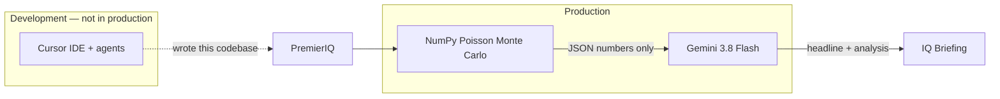
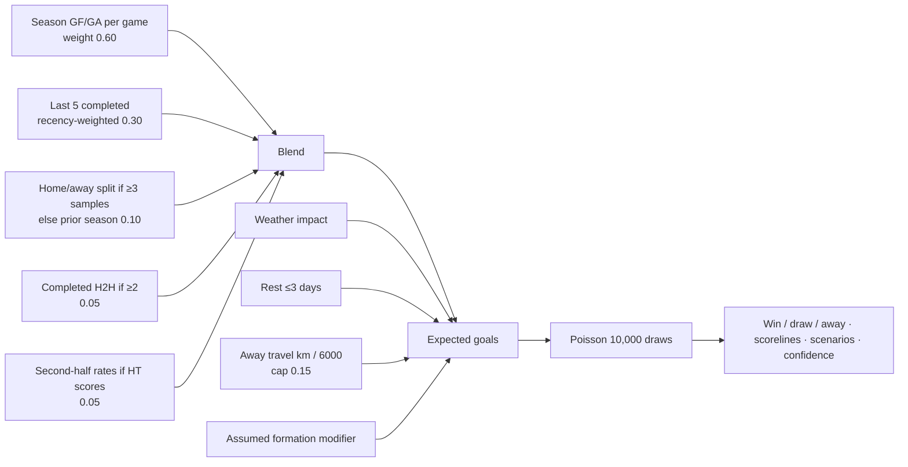
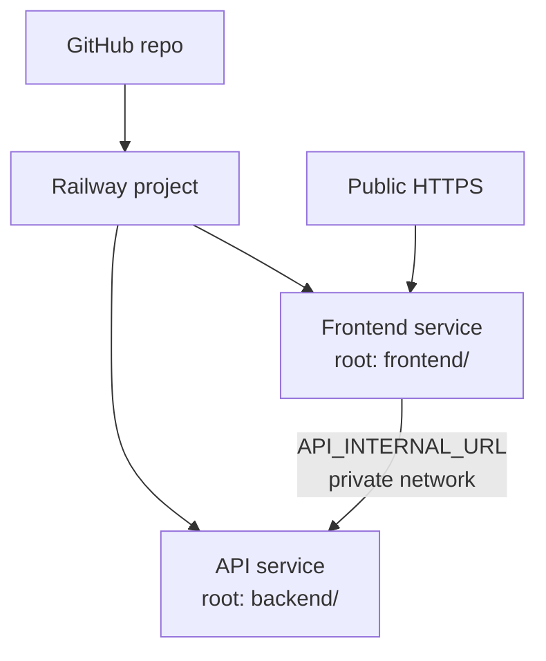

# PremierIQ

Premier League intelligence: live table, Match IQ (10,000 Poisson Monte Carlo runs), squad and scorer intelligence, night-mode stadium map, and remaining-fixture Season IQ.

**Source:** [github.com/code-by-panashe-sanyanga/PremierIQ](https://github.com/code-by-panashe-sanyanga/PremierIQ)

There is **no database and no user auth**. Secrets live only on the server. The browser never receives API keys.

**Local:** [http://127.0.0.1:3000](http://127.0.0.1:3000)  
**API process:** [http://127.0.0.1:8000](http://127.0.0.1:8000) (not called by the browser; Next.js rewrites `/api/*` here)

---

## What you must supply (Railway / GitHub)

Do this before deploy. **Never commit real keys. Never prefix keys with `NEXT_PUBLIC_`.**

| You provide | Where to get it | Used by | Required? |
|---|---|---|---|
| GitHub repo | [code-by-panashe-sanyanga/PremierIQ](https://github.com/code-by-panashe-sanyanga/PremierIQ) | Railway Git deploy | Yes |
| Railway account + project | [railway.app](https://railway.app) | Hosting | Yes |
| `FOOTBALL_DATA_API_KEY` | [football-data.org](https://www.football-data.org/) → register → API token. Free tier covers Premier League (`PL`) at about **10 requests/minute**. | FastAPI → `X-Auth-Token` | **Yes** |
| `OPENWEATHER_API_KEY` | [OpenWeather](https://openweathermap.org/api) Current Weather. UK dashboard: [dashboard.openweather.co.uk](https://dashboard.openweather.co.uk/) | FastAPI stadium conditions | Strongly recommended (Open-Meteo is the no-key fallback) |
| `GEMINI_API_KEY` | [Google AI Studio](https://aistudio.google.com/apikey) | Match IQ briefing narrator only | Optional. If missing, simulations still run; briefing is omitted |
| Public frontend URL (after first Railway deploy) | Railway service domain, e.g. `https://premieriq-frontend.up.railway.app` | `CORS_ORIGINS` on the API | Yes, once you have it |
| Custom domain (optional) | Your DNS | `CORS_ORIGINS` + `TRUSTED_HOSTS` | No |

Optional alias: `GOOGLE_API_KEY` is accepted if `GEMINI_API_KEY` is unset (same Gemini client).

After Railway gives you URLs, also set:

- **API service:** `CORS_ORIGINS`, `TRUSTED_HOSTS`
- **Frontend service:** `API_INTERNAL_URL` = private URL of the API service (Railway internal hostname, not the public browser URL)

---

## Production architecture

Two Railway services. The user’s browser only talks to the frontend origin. Keys never leave the API container.



### Request path (Match IQ)



### Security boundary



---

## AI models used

Two different roles: **building the repo** vs **running in production**. Only Gemini is called when a user hits Match IQ, and only if a key is set.



| Model / system | Where | Model ID / product | Role |
|---|---|---|---|
| **Cursor** | Local development only | [Cursor](https://www.cursor.com) AI IDE and agents (this repository was built and iterated in Cursor) | Writes and edits application code. **Never called by Railway or by the user’s browser.** Cursor is credited here; it is not a GitHub commit author unless you add a co-author trailer yourself. |
| **Gemini** | FastAPI `backend/app/services/gemini.py` | `gemini-3.8-flash` via [Google AI Studio](https://aistudio.google.com) / `https://generativelanguage.googleapis.com` | Optional **narrator**. Receives the Monte Carlo JSON (xG, probabilities, scorelines, weather, rest days). Returns a short headline and analysis. Prompt forbids invented injuries, lineups, transfers, odds, or xG. |
| **Monte Carlo engine** | `backend/app/services/engine.py` | Not an LLM — NumPy Poisson | Match IQ (10,000 sims) and Season IQ (2,000 season runs). This is the source of truth for numbers. |

**Key:** `GEMINI_API_KEY` (or alias `GOOGLE_API_KEY`). Package: `google-genai`. If the key is missing or Gemini errors, `ai` is `null` and the simulation UI still stands.

Formations in Match IQ are **user-selected simulation assumptions**, not confirmed team sheets, whether Gemini is on or off.

---

## External websites and APIs

| Provider | Base URL / site | Auth | Role |
|---|---|---|---|
| football-data.org | `https://api.football-data.org/v4` · [docs](https://www.football-data.org/documentation/quickstart) | Header `X-Auth-Token` | PL standings, teams, squads, matches, scorers |
| Club crests | `https://crests.football-data.org/{id}.png` | None | UI images |
| OpenWeather | `https://api.openweathermap.org/data/2.5/weather` | Query `appid` | Current stadium weather |
| Open-Meteo | `https://api.open-meteo.com/v1/forecast` | None | Weather fallback |
| Gemini | `https://generativelanguage.googleapis.com` | `GEMINI_API_KEY` / `GOOGLE_API_KEY` | IQ briefing copy |
| OpenFreeMap | `https://tiles.openfreemap.org/styles/liberty` and planet tiles | None | Map style + vector tiles |
| This app | GitHub + Railway | Your tokens | Source and hosting |

**football-data.org on this tier does not return** odds, injuries, confirmed lineups, xG, bookings/subs, stadium capacity, or separate HOME/AWAY tables (only `TOTAL`). PremierIQ does not invent those fields.

**Cache (API process memory, not Redis):**

| Data | TTL |
|---|---|
| Current PL matches / standings / teams | 60s |
| Scorers | 300s |
| Previous season matches | 1800s |
| Weather by lat/lon | 600s |

---

## Product surface

| Section | Behaviour |
|---|---|
| Standings | Live table + competition scorers when the provider returns them |
| Match IQ | Defaults toward listed upcoming fixtures; 10k sims; rest days, H2H, HT/2H, weather, travel fatigue when data exists |
| Squads | Squad, ages, colours, founded, website, coach extras, club scorers |
| Team locations | MapLibre night restyle, 3D buildings, pin fly-to; weather on pin click |
| Season IQ | Remaining listed fixtures × 2000 season runs; rest-day congestion from kickoff dates |

Stadium lat/lon are **local** (`backend/app/services/stadiums.py`), keyed by football-data team IDs, because the provider sends venue names without coordinates.

---

## Match IQ model (deterministic mix + Monte Carlo)



Weights renormalise when a component is missing. Confidence is capped when the sample is thin (`played < 5` → max 64%).

Season IQ applies the same strength idea to every remaining listed fixture (2000 full-table runs) and subtracts rest-day fatigue from calendar spacing. Future kickoff weather is not used.

---

## Tech stack

**Frontend (`frontend/`)**

- Next.js **15.5.25** (App Router), React **19**, TypeScript
- Framer Motion, Lucide, MapLibre GL **6**
- Same-origin `fetch('/api/...')` via `next.config.mjs` rewrites
- Security headers: `X-Frame-Options: DENY`, `nosniff`, referrer policy, permissions policy
- Dev overlay indicator off (`devIndicators: false`)

**Backend (`backend/`)**

- FastAPI, Uvicorn, Pydantic v2, NumPy, httpx, python-dotenv, `google-genai`
- Python **3.12** in Docker; local venv may be 3.9+
- Trusted hosts, CORS allowlist, 90 req/min, OpenAPI **disabled** unless `PREMIERIQ_DEBUG=1`

**Not in this app:** PostgreSQL, Redis, auth, websockets, betting feeds.

---

## HTTP API (FastAPI, prefix `/api`)

Browser path is identical on the frontend origin.

| Method | Path | Notes |
|---|---|---|
| GET | `/health` | On the API process root, not under `/api` |
| GET | `/api/standings` | `TOTAL` table + season metadata |
| GET | `/api/teams` | Clubs + venue/coords |
| GET | `/api/teams/{id}` | Squad, coach, website, colours |
| GET | `/api/teams/{id}/matches` | Status allowlisted |
| GET | `/api/teams/{id}/weather` | Current conditions |
| GET | `/api/scorers` | Competition scorers |
| GET | `/api/fixtures/upcoming` | Next listed PL kickoffs |
| GET | `/api/predict/{home}/{away}` | Live Match IQ |
| POST | `/api/predict` | Manual attack/defence inputs |
| GET | `/api/season/iq` | Remaining-fixture table |
| POST | `/api/season/simulate` | Same as season IQ |
| GET | `/api/stadiums/distance/{a}/{b}` | Haversine km |

Path IDs must be ≥ 1. Simulations are capped (match 100–10 000, season 100–5 000).

---

## Repository layout

```
Premier-main/
  .env.example              # names only, no secrets
  backend/
    Dockerfile
    requirements.txt
    app/
      main.py               # FastAPI app, middleware
      routes.py             # HTTP surface
      security.py           # CORS, rate limit, redaction
      providers/football_data.py
      services/
        engine.py           # Monte Carlo + season IQ
        weather.py
        gemini.py           # narrator
        stadiums.py         # lat/lon table
  frontend/
    Dockerfile
    next.config.mjs         # /api rewrite + headers
    src/middleware.ts       # /api rate limit
    src/app/page.tsx        # single-page product
    src/components/         # Match IQ, map, squads, …
    src/lib/api.ts          # same-origin client
```

---

## Environment variables

### API service (FastAPI)

| Variable | Purpose | Example |
|---|---|---|
| `FOOTBALL_DATA_API_KEY` | football-data.org token | *(secret)* |
| `OPENWEATHER_API_KEY` | OpenWeather token | *(secret)* |
| `GEMINI_API_KEY` | Gemini narrator | *(secret, optional)* |
| `GOOGLE_API_KEY` | Alias if Gemini key unset | *(optional)* |
| `CORS_ORIGINS` | Comma-separated frontend origins | `https://your-frontend.up.railway.app` |
| `TRUSTED_HOSTS` | Host header allowlist | `localhost,127.0.0.1,*.up.railway.app` |
| `PREMIERIQ_DEBUG` | Enable `/docs` | leave empty in prod |
| `PORT` | Set by Railway | listen `0.0.0.0:$PORT` |

### Frontend service (Next.js)

| Variable | Purpose | Example |
|---|---|---|
| `API_INTERNAL_URL` | **Server-only** API base for rewrites | `http://premieriq-api.railway.internal:8080` |
| `PORT` | Set by Railway | `next start -p $PORT` |

There is **no** `NEXT_PUBLIC_API_URL` in the current client. Do not add one; it would point the browser at the API and bypass the proxy.

Copy `.env.example` locally. Keep `.env` gitignored.

---

## Local development

```bash
# API
cd backend
python -m venv .venv
source .venv/bin/activate   # Windows: .venv\Scripts\activate
pip install -r requirements.txt
# keys in backend/.env or repo-root .env
uvicorn app.main:app --reload --host 127.0.0.1 --port 8000

# UI (second terminal)
cd frontend
npm install
# frontend/.env → API_INTERNAL_URL=http://127.0.0.1:8000
npm run dev -- --hostname 127.0.0.1 --port 3000
```

Open **only** `http://127.0.0.1:3000`. Bind the API to loopback for local work.

---

## Railway (two services)



**Recommended split**

1. **API** — root directory `backend/`
   - Start: `uvicorn app.main:app --host 0.0.0.0 --port $PORT`
   - Health: `GET /health`
   - Variables: keys + `CORS_ORIGINS` + `TRUSTED_HOSTS=localhost,127.0.0.1,*.up.railway.app`
2. **Frontend** — root directory `frontend/`
   - Build: `npm install && npm run build`
   - Start: `npm run start -- -p $PORT`
   - Variables: `API_INTERNAL_URL` = `http://<api-service-name>.railway.internal:$PORT` (use the API service’s private domain and port from the Railway UI)

**Order:** deploy API first, copy its private URL into the frontend, then deploy frontend. Then paste the **public** frontend URL into API `CORS_ORIGINS`.

**Rate limits:** football-data.org ~10/min. This app caches, but a cold Season IQ + standings + matches + prior season can burst. Do not add extra provider polling.

**Scale:** in-memory cache and rate limit are **per instance**. One replica per service is the intended setup.

The checked-in Dockerfiles still resemble local/dev (`next dev`, uvicorn `:8000`). Prefer Railway **build/start commands** above, or a production Dockerfile, rather than `docker compose` as-is for prod.

---

## What this app will never pretend to have

- Betting odds or “value” tips  
- Confirmed team sheets or injuries  
- xG from another vendor  
- HOME/AWAY league tables  
- User accounts  

---

## Licence / data attribution

Football data © [football-data.org](https://www.football-data.org/). Weather © OpenWeather and/or Open-Meteo. Map tiles © OpenFreeMap / OpenMapTiles / OpenStreetMap contributors. Gemini © Google when enabled. This project was built with [Cursor](https://www.cursor.com).

PremierIQ © 2026.

---

## Prompt for a similar project

Paste the block below into any coding AI.

```text
You are the implementing engineer. Build a Premier League intelligence web app.

OBJECTIVE
Single-page product, five surfaces: live TOTAL standings, match Monte Carlo, squads,
stadium map, remaining-season table simulation. No database. No auth. No websockets.
Secrets never reach the browser.

STACK
- Frontend: Next.js 15 App Router, React 19, TypeScript, Framer Motion, Lucide, MapLibre GL 6.
- Backend: FastAPI + Uvicorn, Pydantic v2, NumPy, httpx, python-dotenv, google-genai.
- Two processes (Next on :3000, API on :8000). Browser talks same-origin GET/POST /api/*
  only. Next rewrites to a server-only API_INTERNAL_URL. Do not add NEXT_PUBLIC_API_URL.

PROVIDERS (use these; do not invent a second football feed)
- football-data.org v4, header X-Auth-Token, competition PL. Free tier ~10 req/min.
- OpenWeather Current Weather at stadium lat/lon; Open-Meteo fallback if the key is missing
  or OpenWeather fails.
- Optional Gemini 3.8 Flash (GEMINI_API_KEY, alias GOOGLE_API_KEY) as narrator only.
- Map: https://tiles.openfreemap.org/styles/liberty then a night restyle on style.load.
  Club crests from crests.football-data.org. Stadium lat/lon are a local table keyed by
  football-data team IDs (the API gives venue names, not coordinates).

HARD DATA RULES — non-negotiable
football-data.org on this tier does not return odds, injuries, confirmed lineups, vendor xG,
bookings/subs, stadium capacity, or separate HOME/AWAY tables (only TOTAL). Do not invent
those fields in JSON, UI copy, or Gemini text.
Formations are user-selected simulation assumptions, labelled as such, never as team sheets.
Gemini receives Monte Carlo JSON only. The model prompt must forbid invented injuries,
lineups, transfers, suspensions, odds, xG, and betting advice. If the key is missing or
Gemini errors, ai is null and the simulation UI still stands. Numbers come from NumPy,
never from the LLM.

MATCH SIMULATION
Blend expected goals then Poisson Monte Carlo (default 10,000 draws, cap 100–10,000):
  season GF/GA per game 0.60
  last-5 completed, recency-weighted 0.30
  home/away split 0.10 if ≥3 samples, else current+prior season
  completed H2H 0.05 if ≥2
  second-half rates 0.05 if HT scores exist
Renormalise when a component is missing. Then apply weather impact, away travel fatigue
min(0.15, km/6000), rest-day fatigue (≤2d → 0.06, ≤3d → 0.03), assumed formation modifiers.
Confidence cap 64% if played < 5. Default the fixture strip toward listed upcoming kickoffs.
Fetch teams and standings as independent calls; do not couple them.

SEASON SIMULATION
Remaining listed PL fixtures × 2,000 full-table runs (cap 100–5,000). Same strength idea.
Rest-day congestion from kickoff calendar only. Do not forecast future weather. If remaining
fixtures cannot be loaded, return a structured unavailable payload, not a crash.

CACHE (in-process TTL, not Redis)
Current PL matches/standings/teams 60s; scorers 300s; previous season 1800s; weather 600s.
Do not poll the football API on an interval. One replica per service is the intended scale.

MAP
Do not wrap MapLibre in a CSS-transform reveal animation (it breaks WebGL). Initialise the
map from useEffect. Liberty tiles, night restyle, 3D buildings, UK maxBounds, lime-ring pins,
flyTo zoom 16.2 / pitch 62. No travel polylines. Section heading is team locations only.
Weather extras on pin click (feels_like, humidity, gust, clouds) when the provider returns them.

UI / HYDRATION
Single page, dark sports-ops aesthetic. Avoid Framer Motion initial={hidden} on SSR-critical
hero content (hydration mismatch). Reveal animations wait until mounted. Season simulation
always in the nav. Next devIndicators: false. Hydration-safe timestamps via useEffect, not
Date.now() in render.

SECURITY
Keys: FOOTBALL_DATA_API_KEY (required), OPENWEATHER_API_KEY (recommended), GEMINI_API_KEY
(optional). CORS allowlist, TrustedHost, 90 req/min on FastAPI and Next /api middleware.
OpenAPI/docs off unless DEBUG=1. Headers: X-Frame-Options DENY, nosniff, referrer and
permissions policy. Do not put a CSP on MapLibre unless you have verified tiles, glyphs,
and workers still load. Upstream failures return a generic public error — never leak
provider exceptions. Path IDs ≥ 1. .env gitignored; .env.example is names only.

DELIVERABLES
backend/ (FastAPI, engine, providers, Gemini narrator, stadiums table) and frontend/
(Next rewrite, components). README covering architecture, env names, two-service Railway
deploy, and AI roles: Gemini is optional narrator; Monte Carlo is source of truth.

Verify locally at http://127.0.0.1:3000 with the API bound to 127.0.0.1:8000. Do not treat
opening :8000 in the browser as the product.
```

